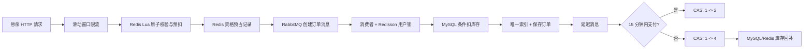

# 黑马点评后端学习指南

> 本文是快速导览；逐模块讲解、端到端实验、故障演练、压测方法与 14 天学习安排，请阅读 `docs/黑马点评后端进阶学习手册.md`。

这份指南不是让你背一段“高并发话术”，而是让你按请求链路把代码跑一遍、故障造一遍、数据核对一遍。完成每节的实验后，再把对应能力写进简历。

## 0. 先把环境跑通

项目已升级为 Java 17 + Spring Boot 3。需要 MySQL、Redis、RabbitMQ 三个外部依赖。

1. 确认 MySQL 中已有 `hmdp2` 数据库，并先检查重复订单：

   ```sql
   SELECT voucher_id, user_id, COUNT(*) AS count
   FROM tb_voucher_order
   GROUP BY voucher_id, user_id
   HAVING COUNT(*) > 1;
   ```

2. 查询结果为空后，执行 `src/main/resources/db/upgrade-rabbitmq.sql`。这个唯一索引是“一人一单”的数据库最终防线，不能只依赖 Redis 或分布式锁。

3. 启动 Redis。默认地址为 `127.0.0.1:6379`、密码为 `123456789`。

4. 启动 RabbitMQ。仓库中的 `docker-compose.rabbitmq.yml` 创建 `hmdp/hmdp123`；如果你使用本机已有的 `guest/guest`，在 PowerShell 中临时覆盖：

   ```powershell
   $env:RABBITMQ_USERNAME='guest'
   $env:RABBITMQ_PASSWORD='guest'
   ```

5. 使用 JDK 17 启动：

   ```powershell
   mvn test
   mvn spring-boot:run
   ```

6. 访问 `http://127.0.0.1:8081/actuator/health`，看到 `UP` 才开始后面的实验。

所有连接参数都能通过环境变量覆盖：`MYSQL_URL`、`MYSQL_USERNAME`、`MYSQL_PASSWORD`、`REDIS_HOST`、`REDIS_PORT`、`REDIS_PASSWORD`、`RABBITMQ_HOST`、`RABBITMQ_PORT`、`RABBITMQ_USERNAME`、`RABBITMQ_PASSWORD`。

## 1. 先理解完整秒杀链路



按下面顺序阅读，不要先钻进 RabbitMQ 配置：

1. `SeckillRateLimitInterceptor` 和 `seckill_rate_limit.lua`：为什么限流必须在库存 Lua 之前。
2. `VoucherOrderServiceImpl.seckillVoucher`：HTTP 线程只做 Redis 预扣和发消息，不写 MySQL。
3. `seckill.lua`：时间窗口、库存、一人一单、资格预占和待确认集合在一次 Lua 中原子完成。
4. `SeckillMessagePublisher`：消息如何变成持久消息，Confirm、Return 分别解决什么问题。
5. `VoucherOrderConsumer`：消费者为什么还要 Redisson 锁、数据库条件更新和唯一索引。
6. `VoucherOrderServiceImpl.createVoucherOrder`：RabbitMQ 至少一次投递下如何实现幂等。

Lua 返回码如下：

| 返回码 | 含义 | API 行为 |
|---:|---|---|
| 0 | 资格预占成功 | 返回已受理订单号 |
| 1 | Redis 库存不足 | 拒绝 |
| 2 | 重复下单 | 拒绝 |
| 3 | 尚未开始 | 拒绝 |
| 4 | 已结束 | 拒绝 |
| 5 | 秒杀数据未初始化 | 提示稍后重试 |

你应该能自己解释：Lua 保证的是 Redis 内部多条命令的原子性，不是 Redis、RabbitMQ、MySQL 三者的分布式事务。因此项目又增加了“资格预占状态机 + 发布恢复任务 + 幂等补偿”。

## 2. 从 Redis Stream 迁移到 RabbitMQ，真正改变了什么

原来的 Stream 消费者组由应用自己轮询 pending-list。RabbitMQ 版本把职责拆为：

- `RabbitMqConfig`：声明持久交换机、创建订单队列、死信队列、延迟队列、关单队列。
- `SeckillMessagePublisher`：统一发送、消息持久化、CorrelationData、Confirm 和 Return 回调。
- `VoucherOrderConsumer`：消费创建订单消息。
- `VoucherOrderDeadLetterConsumer`：处理多次重试仍失败的消息。
- `SeckillPublishRecoveryJob`：解决 Redis 已预扣、应用却在 RabbitMQ 确认前宕机的窗口。

创建订单消息的可靠性路径：

```text
PENDING -> PUBLISHING -> PUBLISHED -> CREATED
                 |            |
                 +-- 超时/NACK/Return --> RETRY
                                      --> 超过次数后 COMPENSATED
```

必须分清三个概念：

- Confirm：Broker 有没有接收消息。
- Return：Broker 收到消息后，能不能按 routing key 路由到队列。
- Consumer ack/retry/DLQ：消费者执行业务是否成功。

### 故障实验

在测试数据上执行，不要使用真实订单：

1. 暂停 RabbitMQ，再发起秒杀。
2. 查看 `seckill:reservation:{orderId}` 与 `seckill:publish:pending`。
3. 恢复 RabbitMQ，观察恢复任务重新投递并创建 MySQL 订单。
4. 将路由键临时改错，观察 Return 回调；实验后恢复代码。
5. 在消费者里临时抛异常，观察重试后进入 DLQ；实验后恢复代码。

做完后，你才能把“可靠投递、失败重试、死信兜底、最终补偿”讲成自己的经验。

## 3. 为什么消费者仍然要三道一致性防线

第一道是 Redisson 锁：`用户 + 优惠券` 锁减少同一用户的并发冲突；`orderId` 生命周期锁让建单、恢复和死信补偿串行，避免数据库提交与 Redis 补偿撞车。

第二道是 MySQL 条件更新：

```sql
UPDATE tb_seckill_voucher
SET stock = stock - 1
WHERE voucher_id = ? AND stock > 0;
```

受影响行数为 0 就代表数据库库存不足，不会把库存扣成负数。

第三道是数据库唯一索引 `(voucher_id, user_id)`。锁可能因部署、超时或代码错误失效，唯一索引仍能给出最终约束。

RabbitMQ 采用至少一次语义，所以重复消息是正常情况。相同 `orderId` 已存在时返回 `IDEMPOTENT_SUCCESS`，不会再次扣库存。不要把“消息绝不会重复”当成设计前提。

## 4. 超时订单与支付竞争

订单创建后，生产者向无消费者的延迟队列发送一条带 TTL 的消息。消息过期后通过死信交换路由至关单队列。

- 支付：`status = 1 -> 2`
- 关单：`status = 1 -> 4`

两个更新都把旧状态 `status = 1` 放在 SQL 条件里，因此并发时只会有一个成功。这是数据库 CAS 思路。

关单成功后：

1. 同一数据库事务中回补 MySQL 库存。
2. 事务完成后用幂等 Lua 回补 Redis 库存、移除“一人一单”标记、把预占状态改为 `CANCELLED`。
3. `OrderTimeoutFallbackJob` 定期扫描，弥补延迟消息丢失或 RabbitMQ 短时不可用。

为了快速实验，可临时设置：

```powershell
$env:SECKILL_ORDER_TIMEOUT_MILLIS='30000'
```

然后创建订单、不支付，30 秒后查询 `/voucher-order/{id}/status`，核对订单状态与两侧库存。实验结束后删除该环境变量。

## 5. Caffeine + Redis 双层缓存

店铺查询入口为 `ShopServiceImpl.queryById`，具体策略集中在 `ShopCacheService` 和 `LogicalExpireCacheClient`。

请求顺序是：

1. 查 Caffeine L1；命中直接返回。
2. BloomFilter 明确判定不存在时直接返回，拦截穿透。
3. 查 Redis L2。
4. 空字符串代表“数据库不存在”，用短 TTL 缓存空值。
5. 逻辑未过期直接返回。
6. 逻辑已过期仍返回旧值，只允许一个线程异步重建。
7. 冷启动 miss 使用 Redisson 互斥锁并二次检查，避免缓存击穿。
8. TTL 加入约正负 10% 随机抖动，降低大量 key 同时失效导致的雪崩。

店铺更新提交后先删当前 JVM 的 L1 和 Redis L2，再用 Fanout Exchange 通知每个实例清除自己的 L1。写操作和缓存重建使用同一把 Redisson 锁，避免数据库已更新后，旧查询又把旧值写回缓存。

### 缓存实验

连续调用两次：

```powershell
Invoke-RestMethod http://127.0.0.1:8081/shop/1
Invoke-RestMethod http://127.0.0.1:8081/shop/1
```

再访问 `http://127.0.0.1:8081/actuator/prometheus`，搜索：

- `hmdp_cache_local_requests_total`
- `hmdp_cache_redis_requests_total`
- `hmdp_cache_bloom_rejected_total`

第一次通常是 L1 miss，第二次应为 L1 hit。删除 Redis 店铺 key、重启应用、查询不存在的 ID，分别观察冷启动、空值缓存和 Bloom 拒绝。

## 6. 监控和压测：不要先写数字

`load-test/shop-cache.js` 与 `load-test/seckill.js` 是 k6 脚本。先阅读 `load-test/README.md`，再压测。

压测报告至少记录：

- 硬件、JVM 参数、应用实例数。
- MySQL/Redis/RabbitMQ 版本与部署方式。
- 测试数据量、并发模型、持续时间。
- QPS、P50/P95/P99、错误率。
- Caffeine/Redis 命中率、消费者积压、CPU、内存、连接池。
- 压测后三个不变量：库存不为负；一人最多一单；Redis 库存与有效订单/预占能对账。

简历图片里的 `20,000 QPS`、`95%`、`P95 50ms` 目前都没有在你的环境中验证，不能直接使用。压测结果不理想也有价值：先找到瓶颈，再用前后对照证明优化效果。

## 7. CI/CD

`.github/workflows/backend-ci-cd.yml` 已完成：

1. 每次 push 或 pull request 使用 JDK 17 执行测试。
2. push 到主分支后构建 Docker 镜像并推送 GHCR。
3. 如果仓库配置了 `DEPLOY_WEBHOOK_URL` Secret，则调用部署 Webhook；没有配置就安全跳过。

`Dockerfile` 负责运行打包后的后端 jar。学习时先在本地执行 `mvn clean package` 和 `docker build`，确认镜像可启动，再配置 GitHub 仓库权限与部署 Secret。

## 8. 其他补齐项

- `/user/logout` 现在会删除 Redis token，会话立即失效；接口保持幂等。
- 秒杀券新增后，只有数据库事务提交成功才初始化 Redis 库存与时间窗口。
- 应用启动时会为旧秒杀券补齐 Redis 数据，但使用 `setIfAbsent`，不会把已经预扣过的实时库存覆盖回数据库初始值。
- BloomFilter 和秒杀券初始化失败不会拖垮应用，会降级并定时重试。
- Spring Boot 已升级到 3.x，相应 `javax.*` 已迁移为 `jakarta.*`。

## 9. 推荐学习顺序

每一阶段都要求“画链路、跑成功、造故障、查数据、自己复述”五步完成。

1. 单机正确性：读 Lua、订单事务、唯一索引。
2. 异步化：读 RabbitMQ 拓扑和消费者。
3. 可靠性：做 NACK、Return、宕机恢复、DLQ、补偿实验。
4. 超时订单：做支付与关单并发实验。
5. 缓存：观察 L1/L2/Bloom/逻辑过期指标。
6. 压测：固定环境，做基线与优化后的对照报告。
7. CI/CD：亲手让一次提交经过测试、构建镜像和部署回调。

暂时不要为了匹配网上简历硬凑“5 个 Starter”。Starter 的价值是跨项目复用；当前只有一个后端应用。等你把上面功能吃透并有第二个项目后，可依次抽取缓存、RabbitMQ 可靠消息、ID 生成、登录鉴权、监控五个 Starter，并为每个 Starter 写自动配置测试。这样才是可信的模块化经验。

## 10. 你可以怎样描述这个项目

在没有真实压测报告前，可以这样描述：

> 将秒杀下单从 Redis Stream 迁移为 RabbitMQ，使用 Redis Lua 原子完成时间校验、库存预扣与一人一单；通过持久消息、Publisher Confirm/Return、重试与死信队列、Redis 预占状态和定时恢复实现最终一致性。消费者使用 Redisson 细粒度锁、数据库条件扣减、唯一索引与幂等判断防止重复下单和超卖，并通过 TTL 死信队列与状态 CAS 自动关闭未支付订单、回补 MySQL/Redis 库存。

缓存部分可以这样描述：

> 为热点店铺实现 Caffeine + Redis 双层缓存，引入 BloomFilter、空值缓存、逻辑过期、Redisson 互斥重建和随机 TTL；更新后通过 RabbitMQ Fanout 广播清理多实例 L1，并通过 Micrometer/Prometheus 和 k6 采集真实命中率、吞吐与延迟。

等你真的跑出报告，再把可复现的 QPS、P95、命中率和机器配置补进去。
