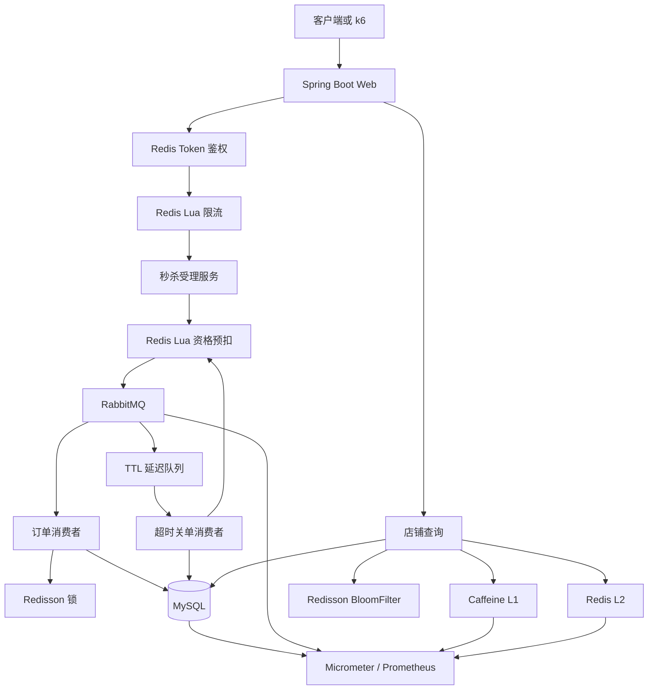
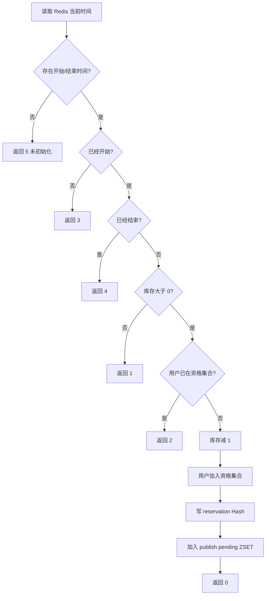
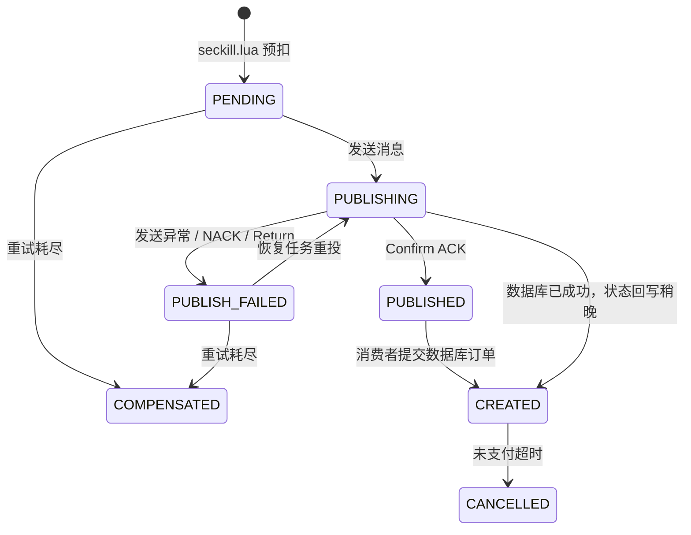
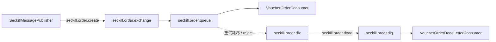
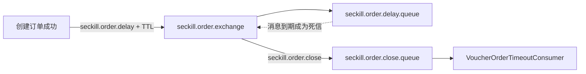
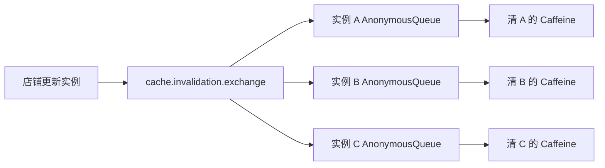
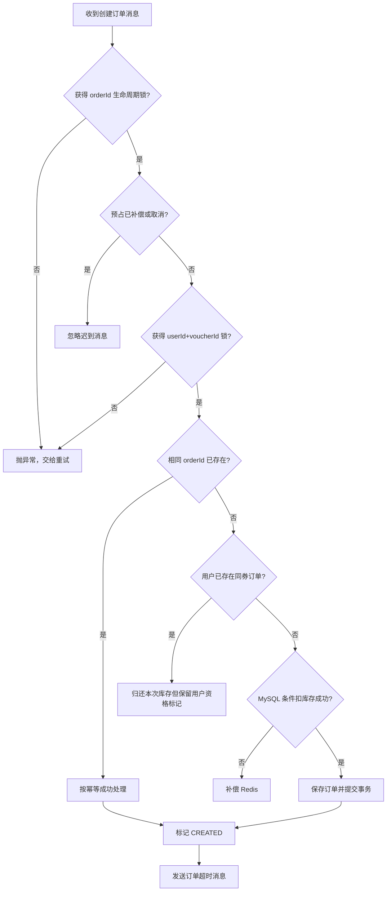
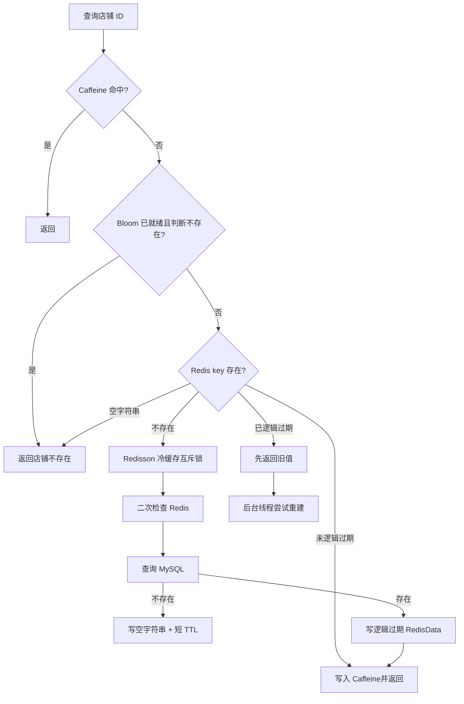

# 黑马点评后端进阶学习手册

> 适用项目：当前仓库中的 `hm-dianping` 后端  
> 技术基线：Java 17、Spring Boot 3.5、MyBatis-Plus、MySQL、Redis、Redisson、RabbitMQ、Caffeine、Micrometer、Prometheus、k6  
> 学习目标：理解代码为什么这样设计，能够独立运行、排错、做故障实验和压测，并用自己的语言说明取舍，而不是背网上简历。

---

## 1. 使用方法与完成标准

这份手册按“先整体、再链路、后故障”的顺序组织。每学习一个模块，都完成下面五件事：

1. 画出调用链或状态图。
2. 从 Controller 跟到数据库、Redis 或 RabbitMQ。
3. 正常运行一次，观察日志与数据变化。
4. 主动制造一次失败，验证兜底是否生效。
5. 不看文档，用三分钟复述设计目标、实现和局限。

真正掌握一个功能的标准不是“代码能跑”，而是你能回答：

- 它解决了什么问题？
- 如果删除它，会出现什么错误？
- 为什么选这个方案，而不是另一个方案？
- 它能保证强一致性，还是最终一致性？
- 发生宕机、重复消息、超时和并发时会怎样？
- 你如何通过日志、Redis、RabbitMQ 和 MySQL 证明它工作正常？

### 1.1 当前实现边界

已经完成的核心后端能力：

- 秒杀接口前置限流。
- Redis Lua 原子资格校验、库存预扣、一人一单和预占记录。
- RabbitMQ 异步创建订单。
- Publisher Confirm、Return、重投、消费重试和死信补偿。
- Redisson 用户锁和订单生命周期锁。
- MySQL 条件扣库存、事务、幂等判断和唯一索引。
- 延迟队列自动关闭未支付订单，MySQL/Redis 库存回补。
- Caffeine + Redis 双层缓存。
- BloomFilter、空值缓存、逻辑过期、互斥重建和随机 TTL。
- RabbitMQ Fanout 广播多实例 L1 缓存失效。
- Actuator、Prometheus 指标、k6 脚本、Dockerfile 和 GitHub Actions。
- Redis token 登录、续期和登出。

暂时没有冒充生产能力的部分：

- `/voucher-order/{id}/pay` 是学习用模拟支付，不是真实支付平台回调。
- 没有实际部署服务器时，GitHub Actions 只能称为“测试、构建和镜像发布流水线”，不能声称已完成生产部署。
- 没有在你的固定测试环境得到报告前，不能声称达到某个 QPS、命中率或 P95。
- 当前是单体项目，没有为了匹配网图强行制造五个 Starter。
- 现有测试以单元测试为主，后续仍应增加 Testcontainers 集成测试。

---

## 2. 项目地图

先记住职责，不要一上来背类名。

| 层次 | 关键文件 | 职责 |
|---|---|---|
| HTTP 入口 | `VoucherOrderController` | 秒杀、查询异步状态、模拟支付 |
| 登录链路 | `RefreshTokenInterceptor`、`LoginInterceptor` | Redis token 解析、续期、登录拦截、ThreadLocal 清理 |
| 秒杀限流 | `SeckillRateLimitInterceptor`、`seckill_rate_limit.lua` | 多实例共享的单券总限流和单用户限流 |
| 秒杀受理 | `VoucherOrderServiceImpl.seckillVoucher` | 生成订单 ID、执行 Lua、发送 RabbitMQ 消息 |
| 原子预扣 | `seckill.lua` | 时间、库存、一人一单、预占记录、恢复索引 |
| MQ 拓扑 | `RabbitMqConfig` | 交换机、业务队列、DLQ、延迟队列、关单队列、缓存广播 |
| 可靠发布 | `SeckillMessagePublisher`、`RabbitMqProducerCallback` | 消息持久化、Confirm、Return、失败状态记录 |
| 预占状态 | `SeckillReservationService`、多个 `seckill_*.lua` | 发布状态迁移、重试、补偿和取消 |
| 创建订单 | `VoucherOrderConsumer` | 生命周期锁、用户锁、调用事务建单、发送超时消息 |
| 数据库事务 | `VoucherOrderServiceImpl.createVoucherOrder` | 幂等、条件扣库存、保存订单 |
| 发布恢复 | `SeckillPublishRecoveryJob` | 扫描未确认消息并重投或最终补偿 |
| 死信兜底 | `VoucherOrderDeadLetterConsumer` | 重试耗尽后检查数据库，再决定成功或补偿 |
| 超时关单 | `VoucherOrderTimeoutConsumer`、`OrderTimeoutProcessor` | 状态 CAS、回补 MySQL 和 Redis 库存 |
| 关单扫描 | `OrderTimeoutFallbackJob` | 延迟消息遗漏时的数据库兜底 |
| 店铺缓存 | `ShopCacheService` | Caffeine L1、BloomFilter、Redis L2 |
| 缓存工具 | `LogicalExpireCacheClient` | 逻辑过期、互斥重建、空值和 TTL 抖动 |
| 更新一致性 | `ShopServiceImpl` | 事务提交后删除缓存并广播 L1 失效 |
| 可观测性 | `application.yaml`、Micrometer Counter | 健康、HTTP、JVM、RabbitMQ、缓存指标 |
| 自动化 | `.github/workflows/backend-ci-cd.yml`、`Dockerfile` | 测试、打包、镜像发布、可选部署回调 |

### 2.1 总体架构



### 2.2 三个必须一直成立的业务不变量

设计和压测时不要只盯 QPS，要先守住正确性：

1. `tb_seckill_voucher.stock >= 0`，数据库库存不能为负。
2. 同一 `(voucher_id, user_id)` 最多存在一条有效订单记录。
3. 在没有处理中消息时，初始库存应能与剩余库存、成功订单和有效预占对账。

第三条可以简化理解为：

```text
初始库存 = Redis 剩余库存 + 尚未补偿的秒杀资格数
初始库存 = MySQL 剩余库存 + 已创建且未取消的订单数
```

异步处理中两边可能短暂不同，这叫最终一致性；稳定后仍然不同才是故障。

---

## 3. 环境准备

### 3.1 Java 与 Maven

当前项目已经永久升级为 Spring Boot 3.5，要求使用 JDK 17。先检查：

```powershell
java -version
mvn -version
```

两条命令显示的 Java 都应该是 17。常见问题是 IDE 使用 JDK 17，但 Maven 仍从系统环境读取 Java 8。

### 3.2 MySQL

默认连接：

```text
地址：127.0.0.1:3306
数据库：hmdp2
用户：root
密码：123456789
```

都能通过环境变量覆盖：

```powershell
$env:MYSQL_URL='jdbc:mysql://127.0.0.1:3306/hmdp2?useSSL=false&allowPublicKeyRetrieval=true&serverTimezone=Asia/Shanghai'
$env:MYSQL_USERNAME='root'
$env:MYSQL_PASSWORD='你的密码'
```

如果数据库已经导入过旧版 SQL，先检查重复订单：

```sql
SELECT voucher_id, user_id, COUNT(*) AS duplicate_count
FROM tb_voucher_order
GROUP BY voucher_id, user_id
HAVING COUNT(*) > 1;
```

结果为空后执行：

```sql
ALTER TABLE tb_voucher_order
ADD UNIQUE INDEX uk_voucher_user (voucher_id, user_id);
```

对应增量文件为 `src/main/resources/db/upgrade-rabbitmq.sql`。唯一索引是最终正确性约束，不要因为 Redis 已做一人一单就省略。

### 3.3 Redis

默认连接：

```text
地址：127.0.0.1:6379
密码：123456789
```

验证：

```powershell
redis-cli -a 123456789 PING
```

期望返回 `PONG`。

### 3.4 RabbitMQ

仓库已经提供 `docker-compose.rabbitmq.yml`：

```powershell
docker compose -f docker-compose.rabbitmq.yml up -d
```

Compose 中的账号为：

```text
用户名：hmdp
密码：hmdp123
管理端：http://127.0.0.1:15672
AMQP：127.0.0.1:5672
```

你的电脑上已有 RabbitMQ 曾使用 `guest/guest`。如果继续使用该实例，启动应用前设置：

```powershell
$env:RABBITMQ_USERNAME='guest'
$env:RABBITMQ_PASSWORD='guest'
```

不要同时让本机 RabbitMQ 和 Docker RabbitMQ 占用 5672 端口。

### 3.5 启动顺序

```text
MySQL -> Redis -> RabbitMQ -> Spring Boot
```

运行：

```powershell
mvn test
mvn spring-boot:run
```

检查健康状态：

```powershell
Invoke-RestMethod http://127.0.0.1:8081/actuator/health
```

只有返回 `UP`，才开始接口和压测实验。

---

## 4. Spring Boot 2 到 3：你实际改了什么

原项目是 Boot 2.3.12 + Java 8；当前是 Boot 3.5 + Java 17。这次迁移不改变秒杀业务思想，但改变了基础框架和依赖兼容线。

### 4.1 Java 基线

Boot 2.3 可以运行在 Java 8；Boot 3 要求 Java 17。Java 17 带来更新的运行时、GC、语言能力和长期支持，但“升级 JDK”本身不会自动把系统变成高并发系统。

### 4.2 `javax` 迁移到 `jakarta`

旧代码：

```java
import javax.annotation.Resource;
import javax.servlet.http.HttpServletRequest;
```

当前代码：

```java
import jakarta.annotation.Resource;
import jakarta.servlet.http.HttpServletRequest;
```

这是 Java EE 迁移到 Jakarta EE 后的命名空间变化。带 Servlet、Validation、JPA 等 API 的旧依赖也必须选 Jakarta 兼容版本。

### 4.3 Redis 配置前缀

```yaml
# Boot 2 常见写法
spring:
  redis:

# 当前 Boot 3 写法
spring:
  data:
    redis:
```

### 4.4 第三方依赖

- MyBatis-Plus 使用 `mybatis-plus-spring-boot3-starter`。
- RabbitMQ 回调接口使用当前 Spring AMQP API。
- MySQL 驱动坐标使用 `com.mysql:mysql-connector-j`。
- Spring 管理的组件版本整体升级。

### 4.5 学习旧课程时的处理方式

看到旧教程中的 `javax`、`spring.redis` 或旧回调 API，不要认为当前代码写错了。先判断是业务设计变化还是框架版本变化：

- Lua 原子性、一人一单、幂等、缓存击穿属于业务与架构知识，版本变化不大。
- 包名、配置前缀、接口签名属于框架适配，应以当前依赖版本为准。

---

## 5. 登录、ThreadLocal 与拦截器顺序

秒杀接口需要先知道当前用户，所以先理解登录链路。

### 5.1 登录数据如何存入 Redis

验证码登录成功后：

1. 生成随机 token。
2. 把 `UserDTO` 转成 Hash。
3. 写入 `login:token:{token}`。
4. 设置登录 TTL。
5. 把 token 返回给客户端。

客户端以后在请求头携带：

```http
authorization: token值
```

### 5.2 两个拦截器为什么有顺序

`MvcConfig` 中顺序为：

```text
order=0 RefreshTokenInterceptor
order=1 LoginInterceptor
order=2 SeckillRateLimitInterceptor
```

`RefreshTokenInterceptor`：

1. 读取 authorization。
2. 从 Redis 查询用户 Hash。
3. 转换为 `UserDTO`。
4. 放入 `UserHolder` 的 ThreadLocal。
5. 刷新 Redis TTL。
6. 请求结束后清理 ThreadLocal。

`LoginInterceptor` 只判断 `UserHolder` 是否有用户，没有就返回 401。

`SeckillRateLimitInterceptor` 必须放在登录之后，因为单用户限流需要 userId。

### 5.3 为什么必须清理 ThreadLocal

Tomcat 线程池会复用线程。如果请求结束不执行 `UserHolder.removeUser()`，下一位用户可能复用到上一个请求线程中的用户信息。这既是内存泄漏风险，也是严重越权风险。

### 5.4 登出为何只删除 Redis token

当前是无服务器 Session 的 token 模式。token 对应的 Redis Hash 被删除后，下一次请求就无法恢复用户信息，因此立即失效。

登出保持幂等：没有 token 或连续调用多次都返回成功，因为目标状态都是“会话不存在”。

---

## 6. 秒杀第一关：前置限流

入口：`SeckillRateLimitInterceptor` 与 `seckill_rate_limit.lua`。

### 6.1 为什么限流放在库存 Lua 之前

库存 Lua 很快，但恶意流量仍会消耗 Tomcat 线程、Redis 连接和 CPU。限流越靠前，后面的资源浪费越少。

默认规则：

```text
单张券总请求：2000 次 / 秒
单用户单券：5 次 / 秒
```

这些值是配置，不是系统承诺。压测后才能调整。

### 6.2 滑动窗口的 Redis 结构

使用两个 ZSET：

```text
rate:seckill:global:{voucherId}
rate:seckill:user:{voucherId}:{userId}
```

score 是 Redis 服务器时间，member 是随机 requestId。Lua 一次完成：

1. 删除窗口之前的记录。
2. 计算当前记录数。
3. 判断总限流。
4. 判断用户限流。
5. 加入本次请求。
6. 给 ZSET 设置自动过期时间。

所有操作在一个 Lua 脚本内，多个应用实例不会各算各的。

### 6.3 返回逻辑

| Lua 返回值 | 含义 | HTTP 行为 |
|---:|---|---|
| 0 | 放行 | 继续秒杀 |
| 1 | 单券总流量超限 | HTTP 429 |
| 2 | 单用户请求过快 | HTTP 429 |

### 6.4 限流不负责什么

限流保护系统，但不保证库存正确。即使限流完全失效，后面的库存 Lua、数据库条件更新和唯一索引仍应保证不超卖、不重复下单。

---

## 7. 秒杀第二关：Redis Lua 原子预扣

入口：`VoucherOrderServiceImpl.seckillVoucher` 与 `seckill.lua`。

### 7.1 为什么先生成订单 ID

当前流程先调用 `RedisIdWorker.nextId("order")`，再执行 Lua。因为预占记录需要以订单 ID 为主键，后续 RabbitMQ、MySQL、状态查询、重试和补偿都使用同一个 ID 串联。

ID 结构：

```text
高 32 位：相对 2022-01-01 的秒级时间差
低 32 位：Redis 按业务、日期生成的自增序列
```

优点：

- 不依赖数据库自增主键。
- 多实例共享 Redis 序列，不容易冲突。
- 高位包含时间，整体趋势递增。
- 每日计数器分 key，避免单一计数器永久增长。

局限：Redis 必须可用；还需要监控时间回拨、序列溢出等极端问题。

### 7.2 Lua 输入

Java 传入：

```text
ARGV[1] voucherId
ARGV[2] userId
ARGV[3] orderId
ARGV[4] Confirm 等待时间
ARGV[5] 预占记录 TTL
```

脚本构造的 Redis key：

```text
seckill:stock:{voucherId}          剩余库存
seckill:order:{voucherId}          已获得资格的用户集合
seckill:begin:{voucherId}          开始时间
seckill:end:{voucherId}            结束时间
seckill:reservation:{orderId}      本次预占详情
seckill:publish:pending             等待确认或重投的 ZSET
```

### 7.3 为什么使用 Redis TIME

Lua 调用 Redis 自己的 `TIME`，而不是相信某台应用服务器的本地时间。多实例部署时，应用机器可能有轻微时钟偏差；统一使用 Redis 时间能让活动窗口判断保持一致。

### 7.4 一次 Lua 完成哪些操作



库存减一、写用户集合、写预占 Hash、写待恢复 ZSET 必须在同一个脚本里。如果分成四条普通 Redis 命令，应用可能执行第一条后宕机，留下“库存已扣但没有任何恢复依据”的孤儿数据。

### 7.5 返回码

| 返回码 | 含义 |
|---:|---|
| 0 | 预占成功 |
| 1 | 库存不足 |
| 2 | 重复下单 |
| 3 | 活动未开始 |
| 4 | 活动已结束 |
| 5 | Redis 秒杀数据未初始化 |

### 7.6 Lua 能保证什么，不能保证什么

能保证：同一个 Redis 实例内脚本中多条操作不会被其他命令插入。

不能保证：Redis、RabbitMQ、MySQL 形成一个跨系统事务。Lua 返回成功后，应用仍可能在消息发送前宕机，所以必须保留预占记录和待恢复 ZSET。

---

## 8. 预占状态机：可靠性的核心

预占 Hash 不是多余数据，它把一次秒杀从“瞬时调用”变成可观察、可恢复的状态机。

### 8.1 状态含义

| 状态 | 含义 | 是否终态 |
|---|---|---|
| `PENDING` | Lua 已预扣，还未真正发送 | 否 |
| `PUBLISHING` | 正在发送，等待 Broker Confirm | 否 |
| `PUBLISH_FAILED` | 发送异常、NACK 或 Return，等待重投 | 否 |
| `PUBLISHED` | Broker 已接收创建订单消息 | 对发布流程是终态 |
| `CREATED` | MySQL 订单已经创建 | 是 |
| `COMPENSATED` | 最终未创建，Redis 库存和资格已补偿 | 是 |
| `CANCELLED` | 订单超时关闭，库存和资格已回补 | 是 |

最容易混淆的是：`PUBLISHED` 只代表 RabbitMQ Broker 接收了消息，不代表 MySQL 订单已经创建。

### 8.2 状态迁移图



### 8.3 为什么状态迁移也使用 Lua

例如发布失败时要同时：

1. 把状态写成 `PUBLISH_FAILED`。
2. 保存失败原因。
3. 刷新 reservation TTL。
4. 把订单重新加入待恢复 ZSET。

如果中途失败，就可能出现“状态显示失败，但恢复任务找不到它”。因此关键状态迁移由多个 `seckill_*.lua` 完成。

### 8.4 为什么需要 reservation TTL

预占不是永久业务数据，长久保存会持续占用 Redis。默认保留 24 小时，并且必须满足：

```text
reservation TTL > 订单超时时间 + 最大故障恢复时间
```

如果把 reservation TTL 设置得比关单时间短，订单到期时可能已经找不到 Redis 预占信息，无法正确回补 Redis 库存。

---

## 9. RabbitMQ 拓扑

### 9.1 创建订单与死信



### 9.2 延迟关单



等待队列故意没有消费者。消息在队列中达到 TTL 后，通过死信路由进入关单队列。

### 9.3 缓存失效广播



每个实例拥有自己的匿名临时队列，Fanout 才能让所有 JVM 都收到一份。如果多个实例共同消费同一个普通队列，只会有一个实例清缓存。

实例离线时匿名队列会消失，但它的内存缓存也随进程消失，因此不需要保存离线期间的失效消息。

---

## 10. RabbitMQ 可靠发布

入口：`SeckillMessagePublisher` 与 `RabbitMqProducerCallback`。

### 10.1 “持久化”需要三项共同成立

1. Exchange 是 durable。
2. Queue 是 durable。
3. Message 的 delivery mode 是 persistent。

只设置其中一个不完整。即便三项都设置，持久化也不是跨机房强一致承诺，因此应用仍需要业务恢复记录和幂等消费。

### 10.2 CorrelationData

创建订单消息使用：

```text
CREATE_ORDER:{orderId}
```

超时消息使用：

```text
CLOSE_ORDER:{orderId}
```

回调拿到 CorrelationData 后，才能知道是哪一笔订单成功或失败。

### 10.3 Confirm 和 Return 的区别

| 机制 | 回答的问题 | 典型失败 |
|---|---|---|
| Publisher Confirm | Broker 是否接收消息到 Exchange | Broker 异常、Exchange 不存在 |
| Publisher Return | Exchange 接收后能否路由到 Queue | routing key 错误、没有绑定 |
| Consumer ack/retry | 消费者业务是否执行成功 | 数据库异常、锁冲突、代码异常 |

简化记忆：

```text
Confirm：到没到交换机？
Return：从交换机找到队列了吗？
Consumer ack：队列里的消息处理完了吗？
```

### 10.4 为什么 `mandatory=true`

如果消息无法路由，又没有启用 mandatory/returns，生产者可能只看到 Exchange 已确认，却不知道没有任何队列接收消息。

### 10.5 首次发送异常为何仍返回订单号

Lua 已经成功预扣，此时 HTTP 层不能假装什么都没发生。代码记录错误后仍返回“已受理订单号”，后台恢复任务会：

- 重投成功并最终创建订单；或
- 达到次数上限后补偿 Redis。

调用方可以通过 `/voucher-order/{id}/status` 查询处理阶段。

这属于异步受理语义，不代表下单最终成功。

---

## 11. 发布恢复任务

入口：`SeckillPublishRecoveryJob`。

### 11.1 为什么有 Confirm 仍需要恢复任务

考虑这个时间点：

```text
Lua 预扣成功 -> 应用进程立即崩溃 -> 还没调用 RabbitTemplate
```

此时没有消息，自然也不会产生 NACK 或 Return。只有 Lua 写入的 `seckill:publish:pending` 能证明存在未完成预占。

### 11.2 扫描逻辑

每隔约 3 秒：

1. 从 ZSET 读取 score 已到期的 orderId。
2. 尝试获取 `lock:seckill:lifecycle:{orderId}`。
3. 查询 reservation。
4. 已完成状态则清理 ZSET。
5. MySQL 已有订单则标记 `CREATED` 并补发超时消息。
6. 未达到最大次数则重新发布创建订单消息。
7. 达到最大次数则执行 Redis 补偿。

### 11.3 生命周期锁解决的竞态

危险场景：

```text
消费者：正在提交 MySQL 订单
恢复任务：刚查询到数据库还没有订单，准备补偿 Redis
```

如果两者并发，可能出现数据库订单刚提交，Redis 库存却被恢复。当前消费者、恢复任务和死信消费者共用 orderId 生命周期锁，让“建单”和“最终补偿”串行。

用户锁解决“一名用户重复下单”，生命周期锁解决“同一订单不同处理器发生状态竞争”，两者不是同一把锁。

### 11.4 为什么多实例还要锁

所有应用实例都会执行 `@Scheduled`。同一个 ZSET 到期项可能被多个实例同时读到。生命周期锁确保只有一个实例处理同一 orderId。

---

## 12. 消费者、事务与幂等

入口：`VoucherOrderConsumer` 与 `VoucherOrderServiceImpl.createVoucherOrder`。

### 12.1 消费流程



### 12.2 为什么重复消息是正常情况

RabbitMQ 可靠消费通常是“至少一次”：

1. 消费者保存订单并提交。
2. 应用在 ack 前宕机。
3. Broker 认为消息没有完成，重新投递。

因此不能以“消息绝不重复”为前提，而要让相同消息重复执行仍得到正确结果。

### 12.3 两种重复必须分开

相同 `orderId` 已存在：说明同一消息重投，返回 `IDEMPOTENT_SUCCESS`，不能再次扣库存。

同一 `userId + voucherId` 已有另一 orderId：说明用户已经买过该券。本次预扣库存要归还，但不能删除原订单对应的用户资格标记。

这就是 `compensate(..., removeUserQualification)` 参数存在的原因。

### 12.4 数据库条件扣库存

核心思想：

```sql
UPDATE tb_seckill_voucher
SET stock = stock - 1
WHERE voucher_id = ?
  AND stock > 0;
```

`stock > 0` 与扣减在同一条 SQL 中。多个事务竞争时，由数据库行锁串行修改；受影响行数为 0 表示库存不足。

错误写法是先 `SELECT stock`，Java 判断大于 0，再执行无条件 UPDATE。两个线程可能同时读到库存 1，然后都扣减。

### 12.5 为什么 Redis 判断后 MySQL 还要判断

Redis 是高性能前置闸门，MySQL 是最终事实数据。发生缓存初始化错误、人工改值、补偿 bug 或历史脏数据时，数据库仍必须守住库存非负。

### 12.6 为什么还要唯一索引

Java 中的“先查询是否存在，再插入”不是原子操作。两个并发事务都可能查询为不存在，然后同时插入。数据库唯一索引才是最后一道不可绕过的约束。

三层防线分别是：

```text
Redis Lua：挡住绝大部分无效请求
Redisson 锁：减少同用户并发竞争
MySQL 唯一索引：最终保证一人一券
```

### 12.7 事务边界

数据库库存扣减和订单 INSERT 位于同一个 Spring 事务中：

- 两者都成功才提交。
- 保存订单抛异常，库存扣减回滚。
- Redis 与 RabbitMQ 不在这个本地事务里，因此依靠状态机和补偿实现最终一致性。

---

## 13. 消费重试与死信队列

### 13.1 当前监听器设置

```text
初始消费者并发：4
最大消费者并发：16
prefetch：50
重试次数：3
初始间隔：1 秒
退避倍数：2
最大间隔：5 秒
最终不重新入原队列：default-requeue-rejected=false
```

`prefetch=50` 表示每个消费者可以预取多条未确认消息，提高吞吐，但也增加单实例暂存的未确认消息数量。它必须结合消息处理时间、内存和消费者数量压测。

### 13.2 什么错误应该重试

适合重试：

- MySQL 临时断连。
- Redis 临时超时。
- 暂时获取不到 Redisson 锁。
- 短暂网络异常。

不适合无限重试：

- 用户已经购买。
- 数据库库存确实不足。
- 消息字段永久非法。

永久业务失败直接补偿；临时异常抛出，让 Spring AMQP 重试。

### 13.3 DLQ 为什么先查数据库

消息进入 DLQ 不代表业务一定失败。可能发生：

```text
MySQL 订单已提交 -> 消费者在 ack 或状态回写前异常 -> 重试耗尽 -> DLQ
```

死信消费者必须先按 orderId 查询数据库：

- 订单存在：按幂等成功处理，标记 CREATED，补发超时消息。
- 订单不存在：再判断同用户同券是否有另一订单，然后安全补偿。

如果不查数据库就回补库存，可能造成有订单、有资格、库存却被归还的超卖窗口。

---

## 14. 延迟关单和支付竞争

### 14.1 为什么创建订单后发送延迟消息

未支付订单会占用库存，不能永久保留。数据库订单创建成功后，发送一条带 TTL 的超时消息；默认 15 分钟后进入关单队列。

### 14.2 支付与关单的状态 CAS

订单状态：

```text
1 未支付
2 已支付
3 已核销
4 已取消
5 退款中
6 已退款
```

支付 SQL 的思想：

```sql
UPDATE tb_voucher_order
SET status = 2, pay_time = NOW()
WHERE id = ? AND user_id = ? AND status = 1;
```

关单 SQL 的思想：

```sql
UPDATE tb_voucher_order
SET status = 4
WHERE id = ? AND status = 1;
```

两者都要求旧状态是 1，所以并发时只有一个更新能成功：

- 支付先成功，关单影响 0 行，不回补库存。
- 关单先成功，支付影响 0 行，提示订单已关闭。

这就是利用数据库条件更新实现 CAS，不需要先加一把覆盖整个支付过程的大锁。

### 14.3 关单后的双端回补

1. MySQL 事务内把订单改为 4，并把数据库库存加一。
2. 事务成功后调用 `seckill_cancel.lua`。
3. Redis 库存加一。
4. 从用户资格集合移除 userId。
5. reservation 改为 `CANCELLED`。

Lua 只允许从 `CREATED` 进入 `CANCELLED`，重复超时消息不会重复增加库存。

### 14.4 为什么还有数据库扫描

超时消息可能因 RabbitMQ 故障、发送失败或配置错误而遗漏。`OrderTimeoutFallbackJob` 定期查询过期的未支付/已取消订单，再调用同一处理器。

RabbitMQ 是主要路径，数据库扫描是兜底路径。两个路径复用 `OrderTimeoutProcessor`，避免写两套稍有不同的关单代码。

### 14.5 TTL 队列的局限

经典队列中不同 TTL 的消息可能出现队头阻塞：后面的短 TTL 消息要等前面的长 TTL 消息离开队头。当前项目默认所有订单使用相同超时时间，影响较小。如果以后每个订单超时时间差异很大，可以研究 RabbitMQ delayed-message 插件、按 TTL 分桶的队列或时间轮方案。

---

## 15. 缓存问题全景

### 15.1 三类典型风险

| 问题 | 场景 | 当前方案 |
|---|---|---|
| 缓存穿透 | 查询根本不存在的数据，每次都打数据库 | BloomFilter + 空值缓存 |
| 缓存击穿 | 一个热点 key 到期，大量请求同时查数据库 | 逻辑过期 + 异步重建；冷 key 使用互斥锁 |
| 缓存雪崩 | 大量 key 同时到期或 Redis 故障 | TTL 随机抖动；Redis 故障仍需限流、降级和高可用 |

不要把三个概念混用。面试时应先描述流量形态，再说解决方案。

---

## 16. Caffeine + Redis 双层缓存

入口：`ShopCacheService` 与 `LogicalExpireCacheClient`。

### 16.1 两层各自解决什么

```text
Caffeine L1：当前 JVM 内存，速度最快，减少 Redis 网络访问
Redis L2：多实例共享，容量更大，重启后仍能共享缓存数据
MySQL：最终事实数据
```

当前 L1 配置：

```text
maximumSize = 10000
expireAfterWrite = 5 分钟
recordStats = true
```

### 16.2 查询流程



### 16.3 BloomFilter

当前设置：

```text
预估容量：100000
期望误判率：1%
```

BloomFilter 特性：

- 判断“不存在”时，应当确实不存在。
- 判断“可能存在”时，仍可能是误判，需要继续查 Redis/数据库。
- 不能像普通集合一样可靠删除单个元素。

启动时从 MySQL 加载所有店铺 ID。初始化失败时 `bloomReady=false`，系统降级为空值缓存，不能使用一个不完整 Bloom 拦截请求，否则会把真实存在的数据误判为不存在。

### 16.4 空值缓存

数据库查询为空时，在 Redis 写入空字符串并设置较短 TTL。攻击者反复查询相同不存在 ID 时，不会每次进入 MySQL。

空值不能永久保存，因为这个 ID 将来可能被新增为真实数据。

### 16.5 逻辑过期

Redis value 不只保存 Shop，还保存：

```json
{
  "data": { "id": 1, "name": "店铺" },
  "expireTime": "逻辑过期时间"
}
```

Redis key 本身可以长期存在，程序读取 `expireTime` 判断新旧：

- 未过期：直接返回。
- 已过期：先返回旧值，再异步重建。

优点是热点请求不等待数据库；代价是允许短时间读到旧数据，所以这是可用性优先的最终一致性方案。

### 16.6 为什么冷 key 不能只用逻辑过期

缓存中完全没有 key 时，没有旧值可以先返回。此时使用 Redisson 互斥锁：

1. 最多等待 2 秒抢锁。
2. 获得锁后再次检查 Redis。
3. 仍不存在才查询数据库。
4. 写缓存后释放锁。

二次检查很关键：线程等待锁期间，另一个线程可能已经完成缓存构建。

### 16.7 本地合并 + 分布式锁

逻辑过期重建先用 `localRebuilding` 合并同一 JVM 的任务，再用 Redisson 锁处理跨 JVM 竞争：

```text
localRebuilding：防止一个实例向线程池塞入大量相同任务
Redisson：防止多个实例同时重建同一个 key
```

Redisson 锁必须在后台工作线程内获取并释放，因为锁所有权与线程绑定。请求线程加锁、后台线程解锁是错误做法。

### 16.8 随机 TTL

逻辑 TTL 和空值 TTL 都加入约正负 10% 抖动，让大量 key 不会在同一秒集中过期。

随机 TTL 只能降低雪崩概率，不能替代 Redis 高可用、请求限流和服务降级。

---

## 17. 缓存更新一致性

### 17.1 为什么更新数据库后删除缓存

采用 Cache Aside：

```text
读：先缓存，未命中再读数据库并回填
写：先更新数据库，事务提交后删除缓存
```

不直接更新缓存，是因为同一份对象可能存在多个缓存结构，更新容易漏字段、漏 key 或产生并发覆盖。删除后让下一次查询按数据库最新值重建更简单。

### 17.2 为什么必须在事务提交后删除

如果数据库事务还没提交就删除缓存：

1. 当前线程删除缓存。
2. 另一个查询线程读到旧数据库值并回填缓存。
3. 当前事务才提交新值。
4. 缓存长期留下旧数据。

当前 `ShopServiceImpl` 通过事务同步回调，在 `afterCommit` 中删除缓存。

### 17.3 为什么更新和重建共用一把锁

更隐蔽的竞争：

```text
查询线程读取旧 DB 值 -> 更新线程提交并删缓存 -> 查询线程把旧值写回
```

店铺更新与缓存重建使用相同的 Redisson key，更新锁持续到事务完成，减少旧值回填窗口。

### 17.4 多实例为什么要广播

删除 Redis 只能清 L2，无法直接访问其他 JVM 的 Caffeine。更新实例：

1. 删除自己的 L1。
2. 删除 Redis L2。
3. 向 Fanout Exchange 广播 shopId。
4. 每个实例只删除自己的 L1，不再次广播。

广播失败时，其他实例的旧 L1 最多在本地 5 分钟 TTL 后自然失效。这仍然是最终一致性，不是绝对强一致。

### 17.5 当前方案还能怎样加强

更严格的生产场景可以考虑：

- 数据库事务 Outbox 记录缓存失效事件。
- CDC 订阅 binlog 后统一失效缓存。
- 给重要更新事件增加重试和持久队列。
- 对强一致读绕过缓存。

这些方案更复杂，应当根据一致性要求选择，而不是全部堆进项目。

---

## 18. 可观测性

### 18.1 Actuator 端点

当前暴露：

```text
/actuator/health
/actuator/info
/actuator/metrics
/actuator/prometheus
```

生产环境不能直接把全部管理端点暴露到公网，应通过独立管理端口、鉴权或网络策略限制。

### 18.2 自定义缓存指标

```text
hmdp_cache_local_requests_total{result="hit|miss"}
hmdp_cache_redis_requests_total{result="hit|miss|stale"}
hmdp_cache_bloom_rejected_total
```

L1 命中率可按区间增量计算：

```text
L1 hit ratio = hit / (hit + miss)
```

不要直接用进程启动以来的累计值比较两段不同压测，应该记录开始和结束值后计算增量。

### 18.3 还应观察的指标

- HTTP 请求数、错误率、P95/P99。
- JVM 堆内存、GC 暂停、线程数。
- HikariCP active、idle、pending、timeout。
- Redis 命令延迟和连接数。
- RabbitMQ published、acknowledged、consumed、rejected、requeued。
- 业务队列 ready/unacked 消息数。
- 恢复任务重试数、补偿数、DLQ 数量。

当前后三个业务计数还可以继续增加自定义 Counter，这是很好的后续练习。

---

## 19. 从零完成一次端到端实验

以下实验会写入测试数据，只在本地学习数据库执行。

### 19.1 启动依赖与应用

确保 MySQL、Redis、RabbitMQ 已启动，然后：

```powershell
$env:RABBITMQ_USERNAME='guest'
$env:RABBITMQ_PASSWORD='guest'
mvn spring-boot:run
```

如果使用 Compose 的 `hmdp/hmdp123`，不需要设置上面两个覆盖值。

### 19.2 获取登录 token

请求验证码：

```powershell
$phone = '13800138000'
Invoke-RestMethod -Method Post "http://127.0.0.1:8081/user/code?phone=$phone"
```

开发环境可从应用 debug 日志或 Redis 查看验证码：

```powershell
redis-cli -a 123456789 GET "login:code:$phone"
```

登录：

```powershell
$code = '替换为真实验证码'
$body = @{ phone = $phone; code = $code } | ConvertTo-Json
$login = Invoke-RestMethod -Method Post `
  -Uri 'http://127.0.0.1:8081/user/login' `
  -ContentType 'application/json' `
  -Body $body
$token = $login.data
$token
```

### 19.3 创建一张测试秒杀券

```powershell
$begin = (Get-Date).AddMinutes(-1).ToString('yyyy-MM-ddTHH:mm:ss')
$end = (Get-Date).AddHours(1).ToString('yyyy-MM-ddTHH:mm:ss')
$voucherBody = @{
  shopId = 1
  title = 'RabbitMQ学习测试券'
  subTitle = '仅用于本地实验'
  rules = '本地测试'
  payValue = 100
  actualValue = 1000
  type = 1
  status = 1
  stock = 5
  beginTime = $begin
  endTime = $end
} | ConvertTo-Json

$voucher = Invoke-RestMethod -Method Post `
  -Uri 'http://127.0.0.1:8081/voucher/seckill' `
  -ContentType 'application/json' `
  -Body $voucherBody
$voucherId = $voucher.data
$voucherId
```

数据库事务提交后，代码才会初始化 Redis 库存和时间窗口。检查：

```powershell
redis-cli -a 123456789 GET "seckill:stock:$voucherId"
redis-cli -a 123456789 GET "seckill:begin:$voucherId"
redis-cli -a 123456789 GET "seckill:end:$voucherId"
```

### 19.4 发起秒杀

```powershell
$headers = @{ authorization = $token }
$result = Invoke-RestMethod -Method Post `
  -Uri "http://127.0.0.1:8081/voucher-order/seckill/$voucherId" `
  -Headers $headers
$orderId = $result.data
$orderId
```

### 19.5 查看异步状态

```powershell
Invoke-RestMethod `
  -Uri "http://127.0.0.1:8081/voucher-order/$orderId/status" `
  -Headers $headers
```

刚返回时可能看到 Redis 阶段；消费完成后应看到数据库订单状态。

### 19.6 检查 Redis

```powershell
redis-cli -a 123456789 GET "seckill:stock:$voucherId"
redis-cli -a 123456789 SMEMBERS "seckill:order:$voucherId"
redis-cli -a 123456789 HGETALL "seckill:reservation:$orderId"
redis-cli -a 123456789 ZRANGE "seckill:publish:pending" 0 -1 WITHSCORES
```

### 19.7 检查 MySQL

```sql
SELECT *
FROM tb_voucher_order
WHERE id = 你的订单ID;

SELECT voucher_id, stock
FROM tb_seckill_voucher
WHERE voucher_id = 你的券ID;
```

### 19.8 验证重复下单

用同一个 token 再调用秒杀接口，应被 Redis Lua 拒绝。数据库中同一用户同一券仍只能有一条订单。

### 19.9 验证模拟支付

```powershell
Invoke-RestMethod -Method Post `
  -Uri "http://127.0.0.1:8081/voucher-order/$orderId/pay" `
  -Headers $headers
```

支付后订单状态为 2，超时消息到达时不能把它改为 4，也不能回补库存。

---

## 20. 故障实验清单

每次只制造一种故障，记录开始状态、动作、日志、恢复后的状态。

### 20.1 RabbitMQ 在 Lua 成功后不可用

目标：验证 reservation + pending ZSET 能覆盖“已预扣但没发出去”。

步骤：

1. 创建库存较小的测试券。
2. 停止 RabbitMQ。
3. 发起秒杀。
4. 查看 reservation 状态和 pending ZSET。
5. 恢复 RabbitMQ。
6. 观察恢复任务重投、订单创建和 ZSET 清理。

### 20.2 错误 routing key

目标：区分 Confirm ACK 和 Return。

步骤：临时把创建订单 routing key 改成一个没有绑定的值，发起测试，观察 Exchange 可能 ACK，但 Return 回调把 reservation 改为失败。实验后立刻恢复代码。

### 20.3 消费者临时抛异常

目标：观察重试间隔和 DLQ。

步骤：在测试分支中让消费者对某个固定 orderId 抛异常，观察 3 次重试、主队列 dead-letter 和 DLQ 消费。不要把故障代码留在主分支。

### 20.4 数据库提交后、ack 前异常

目标：验证相同 orderId 的幂等。

可在保存订单成功后临时抛异常。重新投递时 `getById(orderId)` 应识别为幂等成功，数据库库存不能再次扣减。

### 20.5 超时自动关单

为了缩短实验时间：

```powershell
$env:SECKILL_ORDER_TIMEOUT_MILLIS='30000'
```

创建订单后不支付，等待约 30 秒，检查状态变为 4、MySQL 库存加一、Redis 库存加一、用户资格移除、reservation 变为 `CANCELLED`。

实验后清除：

```powershell
Remove-Item Env:SECKILL_ORDER_TIMEOUT_MILLIS
```

### 20.6 支付与关单并发

在接近超时时间时调用模拟支付，多执行几轮。最终状态只能是 2 或 4，不应该出现：

- 状态为 2 但库存被回补。
- 状态为 4 但支付接口显示成功。
- MySQL 与 Redis 重复加库存。

### 20.7 缓存重建并发

删除某店铺 Redis key、重启应用清空 Caffeine，然后并发请求同一店铺。观察数据库查询次数，验证冷 key 的互斥锁和二次检查。

### 20.8 BloomFilter 与空值缓存

查询一个明显不存在的超大 ID：

- Bloom 已就绪时，应直接拒绝。
- Bloom 初始化失败/未就绪时，应查询数据库一次并写空值。
- 重复请求不应持续击穿数据库。

---

## 21. 故障点与兜底对照表

| 故障时间点 | 可能后果 | 当前兜底 |
|---|---|---|
| Lua 执行前应用失败 | 没有预扣 | 客户端重试即可 |
| Lua 执行后、发送前宕机 | Redis 已扣但 MQ 无消息 | pending ZSET + 恢复任务 |
| 本地发送抛异常 | 消息可能未发送 | 标记失败并定时重投 |
| Broker NACK | Exchange 未接收 | Confirm 回调记录失败并重投 |
| 消息无法路由 | Exchange 收到但 Queue 没收到 | mandatory + Return + 重投 |
| 消费者在事务提交前失败 | 数据库回滚 | 消费重试 |
| 事务提交后、ack 前宕机 | 消息重复投递 | orderId 幂等判断 |
| 用户并发多次下单 | 可能产生不同 orderId | Lua + 用户锁 + 唯一索引 |
| 恢复补偿与消费者提交竞争 | 两侧库存可能不一致 | orderId 生命周期锁 |
| 消费重试耗尽 | 消息成为死信 | DLQ 先查数据库再补偿 |
| 超时消息发送失败/丢失 | 未支付订单长期占库存 | 数据库定时扫描兜底 |
| 支付与关单同时发生 | 状态覆盖或错误回补 | `status=1` 条件 CAS |
| 热点缓存逻辑过期 | 大量请求查数据库 | 返回旧值 + 单线程异步重建 |
| 多实例店铺更新 | 其他 JVM L1 仍旧 | Fanout 广播失效 |

---

## 22. 测试体系

### 22.1 当前已有测试

`RabbitMqConfigTest`：

- 创建订单队列是否正确配置 DLX。
- 延迟队列是否把过期消息路由到关单路径。

`SeckillMessagePublisherTest`：

- 终态 reservation 不再发布。
- Confirm ACK 推进发布状态。
- NACK 进入恢复逻辑。

`OrderTimeoutProcessorTest`：

- 已支付订单不回补 Redis。
- 已取消订单执行幂等 Redis 回补。

`UserServiceImplTest`：

- 登出删除 Redis token。
- 无 token 登出仍保持幂等。

当前共 9 个测试，属于基础单元测试，不代表所有分布式场景已被自动化覆盖。

### 22.2 推荐补充的测试

1. 使用 Testcontainers 启动 MySQL、Redis、RabbitMQ。
2. 对每个 Lua 状态迁移做真实 Redis 测试。
3. 并发发送同用户同券请求，断言唯一订单和非负库存。
4. 验证 RabbitMQ 重投和 DLQ 全链路。
5. 验证支付与关单并发只有一个状态成功。
6. 启动两个应用上下文，验证缓存失效广播。
7. 使用 Awaitility 等待最终一致状态，不用固定 sleep 猜时间。

### 22.3 测试金字塔

```text
大量：纯 Java / Mockito 单元测试
适量：真实 Redis/MySQL/RabbitMQ 集成测试
少量：完整 HTTP 端到端测试
专项：k6 性能与故障演练
```

---

## 23. k6 压测方法

### 23.1 店铺缓存压测

脚本：`load-test/shop-cache.js`。

```powershell
k6 run `
  -e BASE_URL=http://127.0.0.1:8081 `
  -e SHOP_ID=1 `
  -e RATE=100 `
  -e DURATION=30s `
  load-test/shop-cache.js
```

逐级增加 RATE，例如 100、300、500，而不是一开始就把机器压死。每一级都记录：

- 实际迭代速率。
- HTTP 失败率。
- P50/P95/P99。
- dropped iterations。
- CPU、内存、GC。
- L1/L2 命中率。
- MySQL 查询与连接池情况。

### 23.2 秒杀压测

脚本：`load-test/seckill.js`。

```powershell
k6 run `
  -e BASE_URL=http://127.0.0.1:8081 `
  -e VOUCHER_ID=你的券ID `
  -e TOKENS=token1,token2,token3 `
  -e VUS=20 `
  -e DURATION=10s `
  load-test/seckill.js
```

注意：

- 如果所有 VU 共用一个 token，测到的主要是单用户限流和一人一单，不是库存吞吐。
- 要测试抢购，需要准备多个真实用户 token。
- 券库存、token 数量、VU 和限流参数必须记录到报告。
- HTTP 200 只表示请求被业务处理，不一定代表抢券成功，要解析业务 `success` 和返回信息。

### 23.3 压测前后对账

数据库：

```sql
SELECT stock
FROM tb_seckill_voucher
WHERE voucher_id = 你的券ID;

SELECT COUNT(*) AS order_count,
       COUNT(DISTINCT user_id) AS unique_user_count
FROM tb_voucher_order
WHERE voucher_id = 你的券ID
  AND status <> 4;

SELECT user_id, COUNT(*) AS count
FROM tb_voucher_order
WHERE voucher_id = 你的券ID
GROUP BY user_id
HAVING COUNT(*) > 1;
```

Redis：

```powershell
redis-cli -a 123456789 GET "seckill:stock:你的券ID"
redis-cli -a 123456789 SCARD "seckill:order:你的券ID"
redis-cli -a 123456789 ZCARD "seckill:publish:pending"
```

RabbitMQ 管理台检查：

- 主队列 ready/unacked 是否归零。
- DLQ 是否存在异常消息。
- 消费速率能否追上发布速率。

### 23.4 一份可信的压测报告

至少包含：

```text
Git commit：
测试时间：
CPU / 内存：
JDK 与 JVM 参数：
应用实例数：
MySQL / Redis / RabbitMQ 部署：
测试数据量：
请求模型：
持续时间：
QPS：
P50 / P95 / P99：
错误率：
缓存命中率：
队列峰值积压：
三个业务不变量核对结果：
瓶颈和下一步优化：
```

网上简历里的 20,000 QPS、95% 命中率、P95 50ms 不是本项目已证明的结果。只有你能在记录清楚的环境里复现，才可以写进自己的简历。

---

## 24. CI/CD 逐步理解

文件：`.github/workflows/backend-ci-cd.yml`。

### 24.1 Pull Request / Push 阶段

1. Checkout 代码。
2. 安装 Temurin JDK 17。
3. 缓存 Maven 依赖。
4. 执行 `mvn verify`。

测试失败则流水线失败，避免明显错误进入主分支。

### 24.2 主分支镜像发布

1. 再次打包 jar。
2. 使用 GitHub Token 登录 GHCR。
3. 以 commit SHA 生成不可混淆的镜像标签。
4. 根据 `Dockerfile` 构建镜像。
5. 推送到 GitHub Container Registry。

### 24.3 部署 Webhook

只有配置 `DEPLOY_WEBHOOK_URL` 时才调用。服务器端仍需自己实现：

1. 验证 Authorization token。
2. 拉取指定镜像。
3. 滚动或安全重启服务。
4. 检查健康端点。
5. 失败时回滚上一镜像。

因此当前代码具备“可选部署通知”，不是凭空拥有完整生产发布平台。

### 24.4 Secrets

数据库密码、RabbitMQ 密码、Webhook token 不能写进镜像或公开仓库。生产环境通过 GitHub Secrets、服务器环境变量或专门的密钥服务注入。

---

## 25. Redis Stream 与 RabbitMQ 如何比较

### 25.1 Redis Stream

优点：

- 已有 Redis 时部署简单。
- 支持消费组和 pending list。
- 数据结构与 Lua 预扣可以更紧密地放在同一 Redis 体系。

代价：

- 重试、死信、路由和监控通常需要更多业务代码。
- Redis 同时承担缓存、锁、库存、消息等职责，故障域更集中。

### 25.2 RabbitMQ

优点：

- 专业消息 Broker。
- Exchange/Binding 路由能力清晰。
- ack、重试、DLX、管理台和监控生态成熟。
- 业务消息与缓存 Redis 的职责更容易分开。

代价：

- 多一个外部组件需要部署和运维。
- Redis 预扣与 MQ 发布之间不再有单系统原子性，必须做可靠发布和补偿。
- 依然是至少一次语义，消费者必须幂等。

### 25.3 当前项目为什么适合 RabbitMQ

学习目标包含削峰、可靠发布、路由、死信和延迟关单，RabbitMQ 能更完整展示消息系统能力。但不要说 RabbitMQ 在所有场景都优于 Stream；选择取决于规模、团队能力、已有基础设施和可靠性需求。

---

## 26. 常见错误与排查顺序

### 26.1 应用启动时报 RabbitMQ `ACCESS_REFUSED`

原因通常是账号与 Broker 实际账号不一致。先确认你使用本机 `guest/guest`，还是 compose 的 `hmdp/hmdp123`。

### 26.2 MySQL 报 `Public Key Retrieval is not allowed`

本地 MySQL 8 使用 `caching_sha2_password` 时，非 TLS 开发连接可在 URL 中加入：

```text
allowPublicKeyRetrieval=true
```

生产环境应正确配置 TLS，而不是无条件照抄本地设置。

### 26.3 秒杀返回“信息未初始化”

检查：

```text
seckill:stock:{voucherId}
seckill:begin:{voucherId}
seckill:end:{voucherId}
```

新增秒杀券必须走业务接口，事务提交后才会预热 Redis；旧数据库数据由启动初始化器补齐。

### 26.4 消息一直不消费

按顺序检查：

1. RabbitMQ 连接是否成功。
2. Exchange、Queue、Binding 是否存在。
3. routing key 是否匹配。
4. ready/unacked 数量。
5. 消费者日志是否反复异常。
6. DLQ 是否收到消息。
7. JSON 消息转换器是否一致。

### 26.5 pending ZSET 长期不清

检查 reservation 状态、attempts、失败 reason、恢复任务日志、Redisson 连接，以及 Broker Confirm 是否回调。

### 26.6 数据库有订单但 Redis 状态不对

先按 orderId 查 reservation，再看消费者、恢复任务和 DLQ 日志。数据库已存在时不能直接补偿；应推进 CREATED 并补发超时消息。

### 26.7 店铺更新后仍读到旧值

检查：

1. 数据库事务是否提交。
2. Redis L2 key 是否删除。
3. 当前 JVM Caffeine 是否删除。
4. 缓存失效 Fanout 消息是否发布。
5. 其他实例匿名队列是否在线。
6. 是否存在旧查询并发回填。

---

## 27. 高频面试问题与回答框架

### 27.1 为什么不让 HTTP 线程直接写 MySQL？

高并发抢购流量远大于数据库能稳定处理的写入量。HTTP 线程只做 Redis 原子资格校验与消息发布，把请求转为可排队的任务，RabbitMQ 按消费者能力平滑写入 MySQL，实现削峰。代价是接口变成异步受理，需要状态查询和最终一致性处理。

### 27.2 Lua 已保证一人一单，为何还需要锁和唯一索引？

Lua 只保护 Redis 当前数据。消息可能重复、Redis 数据可能被清理或初始化错误，数据库仍要独立保证正确性。Redisson 锁减少同用户并发竞争，MySQL 唯一索引提供最终不可绕过的约束。

### 27.3 Confirm ACK 是否代表下单成功？

不是。ACK 只代表 Broker 接收消息到 Exchange。消息还要正确路由、排队、被消费者处理并提交 MySQL。数据库订单存在或 reservation 进入 CREATED 才表示建单完成。

### 27.4 如何解决 Redis 扣库存后消息没发出去？

Lua 在预扣时同时写 reservation 和 pending ZSET。发布异常、NACK、Return 会记录失败；定时恢复任务扫描到期项重投。达到次数上限后，在生命周期锁内确认数据库无订单，再用 Lua 幂等补偿 Redis。

### 27.5 为什么不用分布式事务或 2PC？

秒杀更关注吞吐和可用性。跨 Redis、RabbitMQ、MySQL 的强事务会增加耦合、延迟和故障复杂度。当前选择本地原子操作、可靠消息、幂等消费、状态机、补偿和对账，实现可恢复的最终一致性。

### 27.6 如何保证消息不重复消费？

不保证消息不重复，而是保证重复消费不会产生重复业务效果。相同 orderId 先查数据库，已存在则按幂等成功处理；同用户同券还有唯一索引兜底。

### 27.7 用户锁与生命周期锁有什么区别？

用户锁的 key 是 `userId + voucherId`，防止同一用户并发购买同一券。生命周期锁的 key 是 `orderId`，让建单、恢复和死信补偿串行，避免数据库提交与 Redis 补偿竞争。

### 27.8 为什么逻辑过期能解决缓存击穿？

热点 key 到期后仍保留旧值，请求先拿旧值返回，只有一个线程异步重建。这样热点流量不会同时阻塞等待数据库。代价是允许短暂旧数据。

### 27.9 BloomFilter 和空值缓存为什么同时使用？

BloomFilter 在前面快速挡住绝大多数不存在 ID，但有误判，也可能初始化失败。空值缓存是后续兜底，避免误判通过或 Bloom 未就绪时相同不存在 ID 反复查数据库。

### 27.10 更新数据库后为什么删除缓存，不直接更新？

删除策略更容易覆盖多字段和多缓存结构，下一次读从数据库重建。删除必须在数据库事务提交后进行，并通过广播清理所有实例的 L1。

### 27.11 你的项目达到多少 QPS？

正确回答不是引用网图，而是给出自己的测试环境、请求模型、持续时间、QPS、P95、错误率、瓶颈和对账结果。如果尚未测试，应坦诚说目前完成了脚本和指标，数据正在实测，不能编造数字。

---

## 28. 14 天学习安排

每天建议 1.5～3 小时。每天都要留下笔记、图或实验记录。

### 第 1 天：启动与项目地图

- 配好 JDK 17、MySQL、Redis、RabbitMQ。
- 执行测试并启动应用。
- 打开健康端点和 RabbitMQ 管理台。
- 手画总体架构图。

验收：能说清每个中间件负责什么，能独立解决连接账号错误。

### 第 2 天：登录与拦截器

- 跟踪验证码、登录、token Hash、续期、登出。
- 理解 ThreadLocal 和线程池复用风险。
- 用 PowerShell 完成登录并访问受保护接口。

验收：能解释三个拦截器为什么是 0、1、2 顺序。

### 第 3 天：RedisIdWorker 与限流 Lua

- 拆解 64 位订单 ID。
- 逐行阅读滑动窗口脚本。
- 连续调用同用户秒杀接口，观察 HTTP 429。

验收：能说明固定窗口与滑动窗口的差别，以及限流为何不等于防超卖。

### 第 4 天：秒杀 Lua

- 逐行阅读 `seckill.lua`。
- 观察 stock、order set、reservation、pending ZSET。
- 分别测试未开始、已结束、库存不足和重复下单。

验收：不看代码写出五类 key 和六个返回码。

### 第 5 天：RabbitMQ 拓扑

- 在管理台找到所有 Exchange、Queue、Binding。
- 画出创建订单、DLQ、延迟关单三条路由。
- 理解 durable、persistent、routing key。

验收：能从一个 routing key 推导消息进入哪个队列。

### 第 6 天：Confirm、Return 与可靠发布

- 跟踪 `SeckillMessagePublisher`。
- 制造一次错误 routing key。
- 区分 Confirm、Return、Consumer ack。

验收：能说明为什么 Confirm ACK 不等于订单成功。

### 第 7 天：消费者与数据库事务

- 跟踪两把 Redisson 锁。
- 阅读条件扣库存 SQL 思想。
- 理解同 orderId 幂等与同用户同券重复的差别。

验收：能解释 Redis、锁、SQL 条件、唯一索引四层保护各自覆盖什么。

### 第 8 天：恢复、补偿与 DLQ

- 画 reservation 状态机。
- 停 RabbitMQ 做恢复实验。
- 让消费者失败，观察重试和 DLQ。

验收：能按时间线分析任意一个宕机点，并指出由谁恢复。

### 第 9 天：超时关单

- 把超时临时调成 30 秒。
- 分别测试不支付与提前支付。
- 核对订单状态和两侧库存。

验收：能解释状态 CAS 和幂等库存回补。

### 第 10 天：缓存穿透、击穿、雪崩

- 对比三类问题。
- 测试不存在 ID、冷 key、热点逻辑过期。
- 观察数据库日志和 Prometheus Counter。

验收：给出场景后能选正确方案，而不是背术语。

### 第 11 天：双层缓存一致性

- 跟踪 Caffeine -> Bloom -> Redis -> MySQL。
- 理解 afterCommit 和共享重建锁。
- 如果条件允许启动两个应用端口，验证 Fanout 清理 L1。

验收：能画出一次店铺更新后的失效传播。

### 第 12 天：测试

- 阅读已有 9 个测试。
- 自己补一个 Lua 或消费者幂等测试。
- 学习 Testcontainers 测试边界。

验收：能说明 Mockito 单元测试为什么不能证明 RabbitMQ 全链路正常。

### 第 13 天：监控与压测

- 跑店铺缓存基线。
- 跑小库存、多 token 秒杀。
- 保存 k6、Prometheus、RabbitMQ 和数据库对账结果。

验收：完成一页包含环境、数据、结论和瓶颈的测试报告。

### 第 14 天：复盘与简历表达

- 不看文档完整讲一次秒杀链路。
- 回答本手册 11 个面试问题。
- 根据真实实验修改项目描述。
- 列出三个当前方案的局限和改进方向。

验收：能进行 10 分钟项目讲解，并接受连续追问。

---

## 29. 生产化差距与进阶路线

当前实现适合学习和简历项目，但生产系统还需要根据规模补充：

1. 使用 RabbitMQ 集群、Quorum Queue、磁盘与网络告警。
2. Redis Sentinel/Cluster 与数据持久化策略。
3. MySQL 主从、高可用、慢 SQL、连接池容量规划。
4. 可靠事件 Outbox 或 CDC，增强事务后事件投递。
5. 对恢复任务和兜底扫描做分片、限速和告警。
6. 给 DLQ 提供后台查看、人工重放和审计能力。
7. 接入真实支付回调、签名验证、金额校验和支付幂等。
8. 加入统一异常码、参数校验、审计日志和安全策略。
9. 增加 Testcontainers、端到端测试和故障注入测试。
10. 接入 Grafana、告警规则、链路追踪和日志聚合。
11. 对 Redis 与数据库库存做周期对账和修复流程。
12. 做容量评估，而不是把消费者并发数无限调高。

### 29.1 何时抽取 Starter

当第二个项目也需要同一种能力，且配置和扩展点已经稳定，再考虑抽取：

- `cache-starter`：Caffeine/Redis、逻辑过期和指标。
- `reliable-amqp-starter`：Confirm/Return、统一消息头和恢复接口。
- `id-worker-starter`：Redis 分布式 ID。
- `auth-token-starter`：Redis token 和拦截器。
- `observability-starter`：业务 Counter、通用标签和端点策略。

Starter 不应直接依赖黑马点评的 `Shop`、`VoucherOrder` 等业务实体，而应通过接口、泛型、事件或配置提供扩展点。只有真正被两个项目复用并有自动配置测试，才适合写成“封装通用 Starter”。

---

## 30. 最终自测清单

如果下面大部分问题不能脱稿回答，就继续做实验：

- [ ] 能解释为什么订单 ID 要在 Lua 前生成。
- [ ] 能写出秒杀 Lua 涉及的 Redis key。
- [ ] 能说明 Lua 为什么不是分布式事务。
- [ ] 能区分 Confirm、Return 和 Consumer ack。
- [ ] 能画出业务队列、DLQ 和延迟关单队列。
- [ ] 能解释同 orderId 幂等与同用户同券重复的区别。
- [ ] 能说明用户锁和生命周期锁分别解决什么。
- [ ] 能解释数据库条件扣库存为何不会超卖。
- [ ] 能解释唯一索引为何不可省略。
- [ ] 能分析 Lua 后宕机、提交后宕机和重试耗尽三个故障点。
- [ ] 能画出 reservation 状态机。
- [ ] 能解释支付与关单 CAS。
- [ ] 能对账 MySQL 库存、Redis 库存和订单数量。
- [ ] 能区分缓存穿透、击穿和雪崩。
- [ ] 能解释 L1/L2/Bloom/空值/逻辑过期的执行顺序。
- [ ] 能解释为何更新在事务提交后删缓存。
- [ ] 能说明多实例 Caffeine 为什么需要广播。
- [ ] 能独立查看 Prometheus 和 RabbitMQ 指标。
- [ ] 能完成一次有环境记录、有对账结果的 k6 报告。
- [ ] 能诚实说明当前方案的局限，而不是声称“绝对不丢消息、绝对一致”。

---

## 31. 可用于复述的项目总结

完成所有实验后，可以用下面结构组织自己的话，不要逐字背诵：

> 项目将秒杀资格判断放在 Redis，通过 Lua 使用 Redis 服务器时间原子完成活动窗口校验、库存预扣、一人一单、资格预占和待恢复记录。HTTP 线程只负责受理并向 RabbitMQ 发送持久化订单消息，消费者使用 orderId 生命周期锁和用户券锁串行关键操作，在 MySQL 中通过相同 orderId 幂等判断、库存条件更新、事务和用户券唯一索引防止重复下单与超卖。
>
> Redis 预扣与 RabbitMQ 发布之间采用最终一致性：Publisher Confirm、Return 和本地发送异常都会更新预占状态；定时任务扫描未确认记录并重投，重试耗尽后在确认数据库无订单的前提下用 Lua 幂等补偿。消费重试耗尽进入 DLQ，死信处理也先查数据库，避免订单已经提交却错误归还库存。
>
> 订单创建后进入 TTL 等待队列，到期后死信路由至关单队列。支付和关单都用 `status=1` 条件更新实现状态 CAS，关单成功后回补 MySQL 和 Redis 库存，并由数据库扫描弥补延迟消息遗漏。
>
> 店铺热点查询采用 Caffeine L1 和 Redis L2，使用 BloomFilter、空值缓存、逻辑过期、Redisson 互斥重建和随机 TTL 处理穿透、击穿与雪崩。数据库更新提交后删除 L1/L2，并通过 RabbitMQ Fanout 通知其他实例失效本地缓存。最后使用 Micrometer、Prometheus 和 k6 收集真实吞吐、延迟、命中率与队列指标。

最后补上你亲自测得且可复现的数据，包括机器配置、并发模型、QPS、P95、错误率和对账结果，这段经历才真正属于你。

---

## 32. 延伸阅读入口

- Spring Boot 3 Migration Guide：`https://github.com/spring-projects/spring-boot/wiki/Spring-Boot-3.0-Migration-Guide`
- Spring AMQP Reference：`https://docs.spring.io/spring-amqp/reference/`
- RabbitMQ Reliability Guide：`https://www.rabbitmq.com/docs/reliability`
- Redis Lua：`https://redis.io/docs/latest/develop/programmability/eval-intro/`
- Redisson Reference：`https://redisson.pro/docs/`
- Caffeine Wiki：`https://github.com/ben-manes/caffeine/wiki`
- Micrometer Documentation：`https://docs.micrometer.io/micrometer/reference/`
- k6 Documentation：`https://grafana.com/docs/k6/latest/`

